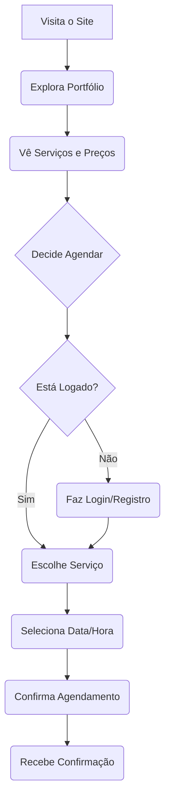
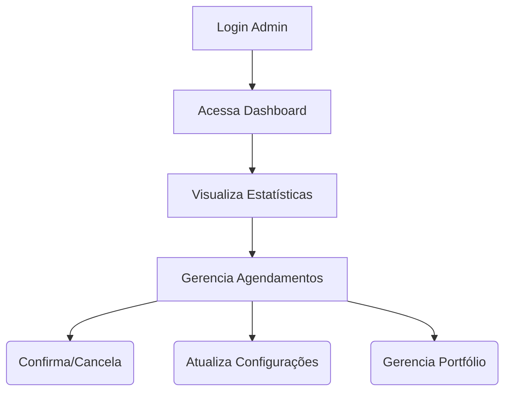

-----

# Barbearia Elite - Portfólio & Sistema de Agendamentos

**Sistema completo para barbearias com portfólio, agendamentos online e painel administrativo**

[Demo ao Vivo](https://barbearia-elite.vercel.app) • [Documentação](https://www.google.com/search?q=%23-funcionalidades) • [Instalação](https://www.google.com/search?q=%23-instala%C3%A7%C3%A3o)

-----

## Sobre o Projeto

**Barbearia Elite** é uma solução digital completa desenvolvida para modernizar barbearias tradicionais. O sistema combina um **site portfólio profissional** com **agendamentos online** e um **painel administrativo** robusto, oferecendo uma experiência digital completa para clientes e proprietários.

### **Problema Resolvido**

  - ❌ Eliminação de agendamentos por telefone
  - 📊 Gestão centralizada de clientes e horários
  - 🎨 Portfólio digital profissional
  - ⚡ Controle administrativo em tempo real

-----

## Funcionalidades

### **Site Principal (Cliente)**

  - 📸 **Portfólio Visual** - Galeria organizada por categorias (cortes/barbas)
  - 💼 **Catálogo de Serviços** - Lista completa com preços e duração
  - 📅 **Sistema de Agendamentos** - Interface intuitiva para marcar horários
  - 🔐 **Autenticação** - Sistema de login/registro para clientes
  - 📱 **Design Responsivo** - Otimizado para mobile e desktop
  - 📍 **Informações de Contato** - Localização, horários e redes sociais

### **Painel Administrativo**

  - 📊 **Dashboard Completo** - Estatísticas em tempo real e visão geral
  - 📋 **Gestão de Agendamentos** - Confirmar, cancelar e gerenciar horários
  - 👥 **Controle de Clientes** - Base de dados completa dos usuários
  - ⚙️ **Gerenciamento da Barbearia** - Configurar serviços, preços e portfólio
  - 🕒 **Controle de Horários** - Definir funcionamento e status (aberto/fechado)
  - 📈 **Relatórios** - Exportação de dados e métricas detalhadas

-----

## ️ Tecnologias Utilizadas

### **Frontend & Framework**

  - **[Next.js 14](https://nextjs.org/)** - Framework React com App Router
  - **[TypeScript](https://www.typescriptlang.org/)** - Tipagem estática para maior segurança
  - **[Tailwind CSS](https://tailwindcss.com/)** - Framework CSS utilitário
  - **[Shadcn/ui](https://ui.shadcn.com/)** - Biblioteca de componentes UI modernos
  - **[Lucide React](https://lucide.dev/)** - Ícones SVG otimizados

### **Backend & Database**

  - **[Firebase](https://firebase.google.com/)** - Plataforma completa do Google
      - **Firestore** - Banco de dados NoSQL em tempo real
      - **Authentication** - Sistema de autenticação seguro
      - **Storage** - Armazenamento de imagens do portfólio
      - **Hosting** - Deploy e hospedagem

### **Desenvolvimento & Deploy**

  - **[Vercel](https://vercel.com/)** - Plataforma de deploy otimizada para Next.js
  - **[GitHub Actions](https://github.com/features/actions)** - CI/CD automatizado
  - **[ESLint](https://eslint.org/)** - Linting e padronização de código

-----

## Instalação e Configuração

### **Pré-requisitos**

  - Node.js 18+ instalado
  - npm ou yarn
  - Conta no Firebase
  - Conta no Vercel (opcional, para deploy)

### **1. Clone o repositório**

```shellscript
git clone https://github.com/seu-usuario/barbearia-elite.git
cd barbearia-elite
```

### **2. Instale as dependências**

```shellscript
npm install
# ou
yarn install
```

### **3. Configure o Firebase**

#### 3.1. Crie um projeto no Firebase

1.  Acesse o [Firebase Console](https://console.firebase.google.com/)
2.  Clique em "Criar um projeto"
3.  Siga as instruções para criar o projeto

#### 3.2. Configure os serviços

1.  **Authentication**: Ative o método "Email/Password"
2.  **Firestore**: Crie um banco de dados em modo de teste
3.  **Storage**: Configure o armazenamento para imagens

#### 3.3. Obtenha as credenciais

1.  Vá em "Configurações do projeto" \> "Geral"
2.  Na seção "Seus apps", clique em "Web"
3.  Copie as configurações do Firebase

#### 3.4. Configure as variáveis de ambiente

Crie um arquivo `.env.local` na raiz do projeto:

```plaintext
NEXT_PUBLIC_FIREBASE_API_KEY=sua_api_key_aqui
NEXT_PUBLIC_FIREBASE_AUTH_DOMAIN=seu_projeto.firebaseapp.com
NEXT_PUBLIC_FIREBASE_PROJECT_ID=seu_projeto_id
NEXT_PUBLIC_FIREBASE_STORAGE_BUCKET=seu_projeto.appspot.com
NEXT_PUBLIC_FIREBASE_MESSAGING_SENDER_ID=123456789
NEXT_PUBLIC_FIREBASE_APP_ID=1:123456789:web:abcdef123456
```

### **4. Execute o projeto**

```shellscript
# Modo desenvolvimento
npm run dev

# Build para produção
npm run build
npm start
```

### **5. Crie o usuário administrador**

```shellscript
node scripts/create-admin.js
```

**Credenciais padrão do administrador:**

  - 📧 Email: `admin@barbearia.com`
  - 🔒 Senha: `admin123`

-----

## Estrutura do Projeto

```plaintext
barbearia-elite/
├── 📁 app/                    # App Router (Next.js 14)
│   ├── 📄 page.tsx            # Página principal do site
│   ├── 📄 layout.tsx          # Layout raiz da aplicação
│   ├── 🎨 globals.css         # Estilos globais
│   └── 🔧 admin/              # Painel administrativo
│       ├── 📊 dashboard/      # Dashboard principal
│       ├── 📅 appointments/   # Gestão de agendamentos
│       ├── 👥 clients/        # Controle de clientes
│       ├── 👤 users/          # Gerenciamento de usuários
│       ├── 🏪 barbershop/     # Configurações da barbearia
│       ├── 🕒 schedule/       # Controle de horários
│       ├── ⚙️ settings/       # Configurações gerais
│       └── 🔐 login/          # Login administrativo
├── 🧩 components/             # Componentes React reutilizáveis
│   ├── 🎨 ui/                 # Componentes base (Shadcn/ui)
│   ├── 🔧 admin/              # Componentes administrativos
│   ├── 🔐 auth/               # Componentes de autenticação
│   ├── 🏠 hero.tsx            # Seção hero da página inicial
│   ├── 💼 services.tsx        # Seção de serviços
│   ├── 📸 portfolio.tsx       # Galeria de portfolio
│   ├── 📅 booking.tsx         # Sistema de agendamentos
│   ├── 📞 contact.tsx         # Informações de contato
│   ├── 🧭 header.tsx          # Cabeçalho do site
│   └── 🦶 footer.tsx          # Rodapé do site
├── 🔧 lib/                    # Utilitários e configurações
│   ├── firebase.ts            # Configuração do Firebase
│   └── utils.ts               # Funções utilitárias
├── 🎯 contexts/               # Context API (React)
│   └── auth-context.tsx       # Contexto de autenticação
├── 📜 scripts/                # Scripts de configuração
│   └── create-admin.js        # Script para criar usuário admin
├── 🎨 tailwind.config.js      # Configuração do Tailwind CSS
├── ⚙️ next.config.mjs         # Configuração do Next.js
└── 📦 package.json            # Dependências e scripts
```

-----

## Design e Interface

### **Paleta de Cores**

  - 🟡 **Primária**: Dourado (`#F59E0B`) - Elegância e sofisticação
  - ⚫ **Secundária**: Cinza escuro (`#1F2937`) - Modernidade
  - ⚪ **Neutra**: Branco (`#FFFFFF`) - Limpeza e clareza
  - 🔴 **Destaque**: Vermelho (`#DC2626`) - Ações importantes

### **Tipografia**

  - **Fonte Principal**: Inter (Google Fonts)
  - **Hierarquia**: Títulos grandes, subtítulos médios, texto legível
  - **Responsividade**: Tamanhos adaptativos para diferentes telas

### **Componentes UI**

  - 🎛️ **Botões**: Estados hover, loading e disabled
  - 📋 **Formulários**: Validação em tempo real
  - 🃏 **Cards**: Layout consistente e sombras suaves
  - 📊 **Badges**: Status coloridos e informativos

-----

## Fluxos de Uso

### **Fluxo do Cliente**



### **Fluxo do Administrador**



-----

## Funcionalidades Técnicas Detalhadas

### **Sistema de Autenticação**

  - 🔐 **Firebase Auth**: Autenticação segura e confiável
  - 👤 **Perfis de Usuário**: Dados personalizados para cada cliente
  - 🛡️ **Proteção de Rotas**: Middleware para páginas administrativas
  - 🔑 **Controle de Acesso**: Diferenciação entre cliente e admin

### **Banco de Dados (Firestore)**

```javascript
// Estrutura das Collections
collections: {
  users: {        // Perfis dos usuários
    name, phone, email, createdAt
  },
  appointments: {   // Agendamentos
    userId, name, phone, email, service, 
    date, time, status, notes, createdAt
  },
  services: {     // Serviços da barbearia
    name, description, price, duration
  },
  portfolio: {      // Imagens do portfolio
    url, category, alt
  },
  settings: {     // Configurações do sistema
    barbershop: { name, description, phone, address },
    schedule: { workingHours, isOpen, closedMessage }
  }
}
```

### **Performance e Otimização**

  - ⚡ **Next.js App Router**: Roteamento otimizado
  - 🖼️ **Image Optimization**: Compressão automática de imagens
  - 📦 **Code Splitting**: Carregamento sob demanda
  - 💾 **Caching**: Estratégias de cache inteligentes
  - 🔄 **Real-time Updates**: Sincronização em tempo real

-----

## Deploy e Produção

### **Deploy no Vercel (Recomendado)**

1.  Conecte seu repositório GitHub ao Vercel
2.  Configure as variáveis de ambiente no painel do Vercel
3.  Deploy automático a cada push na branch `main`

### **Deploy no Firebase Hosting**

```shellscript
# Instalar Firebase CLI
npm install -g firebase-tools

# Login no Firebase
firebase login

# Inicializar projeto
firebase init hosting

# Build e deploy
npm run build
firebase deploy
```

### **Variáveis de Ambiente para Produção**

```plaintext
# Firebase Configuration
NEXT_PUBLIC_FIREBASE_API_KEY=production_api_key
NEXT_PUBLIC_FIREBASE_AUTH_DOMAIN=production_domain
NEXT_PUBLIC_FIREBASE_PROJECT_ID=production_project_id
NEXT_PUBLIC_FIREBASE_STORAGE_BUCKET=production_bucket
NEXT_PUBLIC_FIREBASE_MESSAGING_SENDER_ID=production_sender_id
NEXT_PUBLIC_FIREBASE_APP_ID=production_app_id
```

-----

## Métricas e Analytics

### **Dashboard Administrativo**

  - 📊 **Estatísticas em Tempo Real**:
      - Agendamentos hoje/semana/mês
      - Receita por período
      - Clientes ativos/inativos
      - Status dos agendamentos
  - 📋 **Relatórios Exportáveis**:
      - CSV com dados dos agendamentos
      - Filtros por data, status, cliente
      - Métricas de performance

### **Métricas de Negócio**

  - 💰 **Receita**: Cálculo automático baseado em agendamentos confirmados
  - 👥 **Clientes**: Tracking de novos clientes e retenção
  - 📅 **Agendamentos**: Taxa de confirmação e cancelamento
  - ⏰ **Horários**: Análise de horários mais procurados

-----

## Configurações Avançadas

### **Personalização da Barbearia**

  - 🏪 **Informações**: Nome, descrição, contato, endereço
  - 💼 **Serviços**: Adicionar, editar, remover serviços
  - 💰 **Preços**: Configuração dinâmica de valores
  - 🕒 **Horários**: Definir dias e horários de funcionamento
  - 📸 **Portfólio**: Upload e organização de imagens

### **Configurações do Sistema**

  - 🔔 **Notificações**: Configurar alertas por e-mail
  - 🎨 **Aparência**: Personalizar cores e layout
  - 🔒 **Segurança**: Configurações de autenticação
  - 📊 **Analytics**: Integração com Google Analytics

-----

## Troubleshooting

### **Problemas Comuns**

#### **Erro de Autenticação Firebase**

```shellscript
# Verificar configurações
console.log(process.env.NEXT_PUBLIC_FIREBASE_API_KEY)

# Recriar arquivo .env.local
# Verificar se todas as variáveis estão corretas
```

#### **Erro de Build**

```shellscript
# Limpar cache
rm -rf .next
npm run build

# Verificar dependências
npm install
```

#### **Problemas de Deploy**

```shellscript
# Verificar variáveis de ambiente no Vercel
# Verificar logs de build
# Testar build local primeiro
```

-----

## Documentação Adicional

### **APIs Utilizadas**

  - 🔥 **Firebase Auth API**: Autenticação de usuários
  - 📊 **Firestore API**: Operações de banco de dados
  - 📁 **Firebase Storage API**: Upload de imagens
  - 🌐 **Next.js API Routes**: Endpoints customizados

### **Hooks Customizados**

  - `useAuth()`: Gerenciamento de autenticação
  - `useFirestore()`: Operações de banco de dados
  - `useLocalStorage()`: Persistência local

### **Componentes Reutilizáveis**

  - `<ProtectedRoute>`: Proteção de rotas
  - `<AdminLayout>`: Layout do painel admin
  - `<AuthModal>`: Modal de login/registro
  - `<LoadingSpinner>`: Indicador de carregamento

-----

## Contribuição

Contribuições são muito bem-vindas\! Para contribuir:

### **Como Contribuir**

1.  🍴 Fork o projeto
2.  🌿 Crie uma branch para sua feature (`git checkout -b feature/nova-funcionalidade`)
3.  💾 Commit suas mudanças (`git commit -m 'Adiciona nova funcionalidade'`)
4.  📤 Push para a branch (`git push origin feature/nova-funcionalidade`)
5.  🔄 Abra um Pull Request

### **Diretrizes**

  - 📝 Siga os padrões de código existentes
  - ✅ Adicione testes para novas funcionalidades
  - 📖 Atualize a documentação quando necessário
  - 🐛 Reporte bugs com detalhes e passos para reproduzir

-----

## Licença

Este projeto está sob a licença MIT. Veja o arquivo [LICENSE](https://www.google.com/search?q=LICENSE) para mais detalhes.

-----

## ‍ Autor

**Desenvolvedor Full Stack**

  - 🐙 GitHub: [@seu-usuario](https://github.com/seu-usuario)
  - 💼 LinkedIn: [Seu Perfil](https://linkedin.com/in/seu-perfil)
  - 📧 Email: [seu.email@exemplo.com](mailto:seu.email@exemplo.com)
  - 🌐 Portfólio: [seu-portfolio.com](https://seu-portfolio.com)

-----

## Agradecimentos

Agradecimentos especiais às tecnologias e comunidades que tornaram este projeto possível:

  - 🚀 **[Next.js Team](https://nextjs.org/)** - Framework incrível
  - 🔥 **[Firebase Team](https://firebase.google.com/)** - Infraestrutura robusta
  - 🎨 **[Shadcn](https://ui.shadcn.com/)** - Componentes elegantes
  - 💨 **[Tailwind CSS](https://tailwindcss.com/)** - Sistema de design
  - 🎯 **[Vercel](https://vercel.com/)** - Deploy simplificado

-----

## Roadmap Futuro

### **Versão 2.0**

  - 📱 **App Mobile**: React Native para iOS e Android
  - 💳 **Pagamentos**: Integração com Stripe/PayPal
  - 📧 **Email Marketing**: Campanhas automatizadas
  - 🤖 **Chatbot**: Atendimento automatizado
  - 📊 **Analytics Avançados**: Dashboards detalhados

### **Versão 2.1**

  - 🎨 **Temas Personalizáveis**: Dark mode e cores customizadas
  - 🌍 **Multi-idiomas**: Suporte a português, inglês e espanhol
  - 📱 **PWA**: Progressive Web App
  - 🔔 **Push Notifications**: Notificações em tempo real
  - 📈 **Relatórios Avançados**: Insights de negócio
